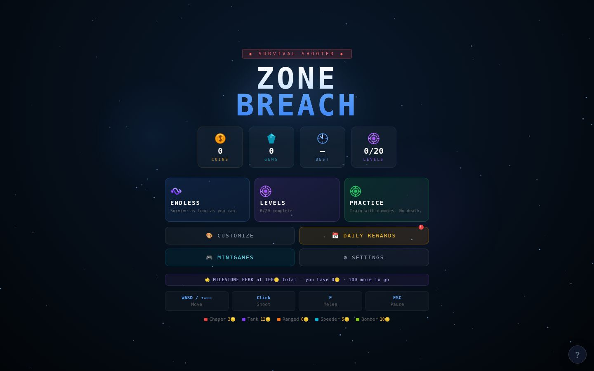
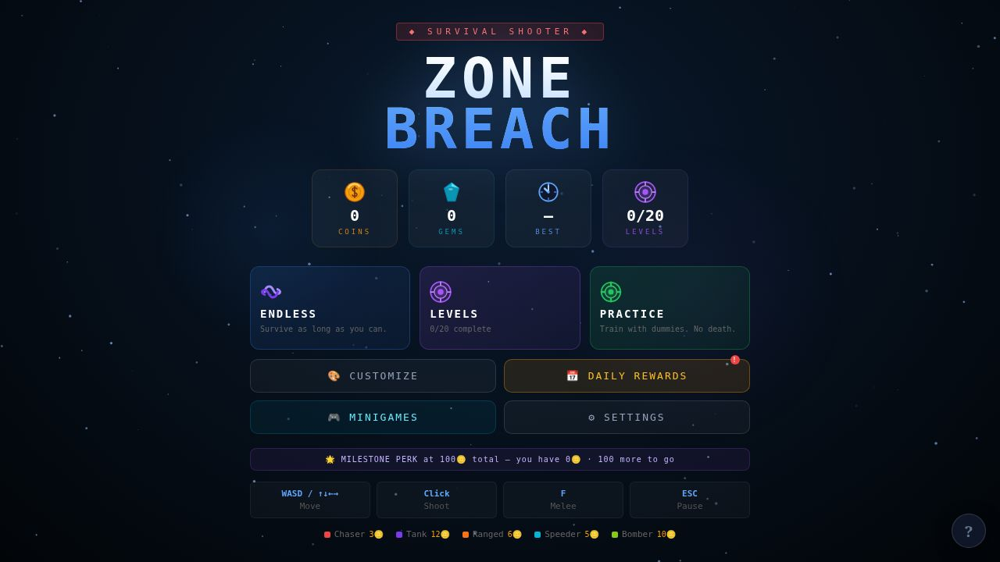

# 🎮 Zone Breach

<div align="center">


**A fast-paced 3D top-down survival arena shooter built with React Three Fiber.**
Survive waves of enemies, unlock powerful weapons, and dominate the arena across six unique maps.

[▶ Play Now](#-installation) · [📸 Screenshots](#-screenshots) · [📐 Game Math](#-game-mathematics) · [🗺️ Roadmap](#-future-plans)

</div>

---

## 📸 Overview

Zone Breach drops you into a relentless survival arena where each wave brings deadlier enemies. Master a growing arsenal of ranged and melee weapons, recruit AI companions, and fight through story-driven levels or endlessly grind for supremacy. Earn coins, gems, and rewards every day — then spend them on unlockable skins, maps, and gear.

---

## 📸 Screenshots

<div align="center">
  
  <br />
  <em>The Zone Breach command screen — choose a mode, customize your loadout, and claim daily rewards.</em>
</div>

<br />

<div align="center">
  
</div>

> More gameplay captures can be added to `artifacts/3d-game/public/assets/screenshots/` as new arenas and combat systems are shipped.

---

## ✨ Features

### 🎯 Core Gameplay
- 🌊 **Wave-based survival** — enemies scale in difficulty with every wave
- 💥 **Multiple enemy types** — Chasers, Ranged, Speeders, Tanks, and Bombers
- 🗡️ **Melee combat** — get up close with swords, axes, and more
- 🔫 **Diverse arsenal** — Pistol, Burst Pistol, Assault Rifle, SMG, Shotgun, Sniper Rifle, Plasma Cannon, Minigun, Trident, and more
- ⚡ **Power-ups** — speed boosts, shields, rapid fire, and health pickups mid-wave
- 🤖 **AI Companions** — recruit allies that fight alongside you

### 🗺️ Game Modes
- 📖 **Story Mode** — progress through handcrafted levels with narrative cutscenes
- ♾️ **Endless Mode** — survive as long as you can with increasing difficulty
- 🎯 **Practice Mode** — sharpen your aim and movement without pressure

### 🌍 Maps
Six fully unique arenas to master:
| Map | Theme |
|-----|-------|
| 🏙️ Urban Arena | City streets and cover |
| 🧊 Ice Fortress | Slippery frozen stronghold |
| 🏜️ Desert Ruins | Ancient ruined landscape |
| 🌋 Volcano Crater | Molten environment |
| 🌑 Shadow Realm | Dark and eerie dimension |
| 🌆 Neon City | Cyberpunk cityscape |

### 🎨 Customization
- 🧑 **Character Skins** — Soldier, Shadow, Neon Striker, Crimson Guard, Arctic Wolf, Toxic, Gold Commander, Phantom, Inferno, Phoenix, War Commander, Cyber Runner, Ghost Squad, and more
- 🔫 **Weapon Skins** — cosmetic overlays for your favourite guns
- 🗡️ **Melee Weapons** — unlock and equip different melee options

### 💰 Progression & Economy
- 🪙 **Coins & 💎 Gems** — dual currency system earned through gameplay
- 📅 **Daily Rewards** — log in every day to claim escalating prizes
- 📋 **Daily Quests** — three fresh objectives every 24 hours
- 🎰 **Spin Wheel** — try your luck for bonus rewards
- 🔓 **Unlockables** — maps, skins, and weapons gated behind currency and progression
- 🏆 **Progression System** — level up and unlock new content as you play

---

## 🎮 Gameplay Overview

You spawn in a closed arena and face endless waves of enemies. Between waves you have a short breather to collect drops, activate power-ups, and reposition. Defeat enough enemies to trigger a **secret portal** that warps you to a hidden bonus level. Companions fight autonomously at your side, and melee finishers let you close the gap when ammo is scarce.

Coins and gems drop from enemies and chests on the map. Spend them in the **Customization Hub** to unlock new skins, the **map store** for new arenas, or blow them on the **Spin Wheel** for a chance at rare rewards.

---

## 🕹️ Controls

| Action | Input |
|--------|-------|
| Move | `W` `A` `S` `D` |
| Aim | Mouse cursor |
| Shoot | Left Mouse Button |
| Melee attack | `F` |
| Pause | `Escape` |
| Use ability | `Q` |

> 🎯 Aim is always relative to your mouse position — click toward an enemy to fire.

---

## 🛠️ Technologies Used

| Technology | Purpose |
|------------|---------|
| ⚛️ **React 19** | UI framework & component tree |
| 🟦 **TypeScript 5.9** | Type-safe codebase |
| ⚡ **Vite 7** | Blazing-fast dev server & bundler |
| 🎲 **React Three Fiber** | Declarative Three.js for React |
| 🌐 **@react-three/drei** | R3F helpers (controls, shaders, etc.) |
| 🐻 **Zustand** | Global game state management |
| 💾 **JavaScript localStorage** | Browser-side progression saves on static hosting such as Vercel |
| 💨 **Tailwind CSS** | HUD and menu styling |
| 🧩 **shadcn/ui** | UI component primitives |

---

## 🚀 Installation

### Prerequisites
- [Node.js](https://nodejs.org/) v20+
- [pnpm](https://pnpm.io/) v9+

### Clone & Run

```bash
# Clone the repository
git clone https://github.com/CodeNovaa28/survival-arena.git
cd survival-arena

# Install dependencies
pnpm install

# Start the development server
pnpm --filter @workspace/3d-game run dev
```

Then open your browser at the address shown in the terminal (default: `http://localhost:PORT`).

### Build for Production

```bash
pnpm --filter @workspace/3d-game run build
```

---

## 💾 Persistence on Vercel

Zone Breach is a client-side game, so it does not require a database to keep a player's browser progression. The game stores the player profile in JavaScript's `localStorage`, which works on Vercel and other static hosts:

- 🪙 Coins, gems, high score, and total earnings
- 🔓 Unlocked levels, maps, weapons, melee gear, skins, and permanent perks
- 🎨 Selected loadout, audio settings, kill effects, and story preference
- 📅 Daily reward timestamps and quest progress
- 🔁 A versioned `zb_profile_v1` snapshot is kept alongside the legacy keys for safer future migrations
- 🚪 A `beforeunload` save flushes the latest profile when the player closes or leaves the page

The save is scoped to the browser origin. A player who returns to the same Vercel URL on the same browser will see their progress; clearing site data or switching browsers/devices starts a separate local profile.

## 📐 Game Mathematics

These are the formulas that drive the current implementation. They are intentionally documented here so balancing changes can be reviewed against the code instead of being guessed from playtests.

### 🌊 Wave mechanics: enemy count and spawn delay

In Endless Mode, a wave is spawned as a batch when the previous wave is cleared or its timer expires:

```text
EnemyCount(w) =
  4,          when w = 1
  3 + 2w,     when w >= 2
```

The base wave timer is **20 seconds**:

```text
WaveTimer(t + Δt) = WaveTimer(t) - Δt
NextWave when WaveTimer <= 0 OR (all enemies defeated AND elapsed time > 3s)
SpawnDelay = max(0, 20s - elapsedWaveTime)
```

Level-based waves use the level definition instead:

```text
LevelEnemyCount(level, w) = baseEnemyCount(level) + (w - 1) × enemyCountPerWave(level)
```

Enemy scaling is applied at creation:

```text
SpeedMultiplier(w) = min(2.5, 1 + 0.12 × (w - 1))
HPMultiplier(w)    = 1 + 0.15 × (w - 1)
```

### 🧭 Vector Tracking Formula (for enemies)

Enemies lead a moving player rather than always chasing the player's current position:

```text
d       = |p_player - p_enemy|
τ       = min(0.5, 0.4 × d / enemySpeed)
p_target = p_player + v_player × τ
u       = normalize(p_target - p_enemy)
p_enemy' = p_enemy + u × enemySpeed × Δt
```

After tracking, obstacle-separation and arena-boundary corrections are applied. This keeps groups from occupying the same point while preserving the predictive chase.

### 🎯 Aiming Trigonometry (for shooting and cursor aiming)

The cursor is converted to normalized device coordinates and raycast onto the arena ground plane:

```text
nx =  2 × (cursorX - canvasLeft) / canvasWidth  - 1
ny = -2 × (cursorY - canvasTop)  / canvasHeight + 1
aim = normalize(groundIntersection - playerPosition)
```

For a weapon with a spread angle `θ`, the horizontal bullet direction is rotated using:

```text
dir(θ) = (
  aimX × cos(θ) - aimZ × sin(θ),
  0,
  aimX × sin(θ) + aimZ × cos(θ)
)
```

Each bullet then advances every render tick:

```text
bulletPosition' = bulletPosition + dir × bulletSpeed × Δt
```

### 💣 Timer/Tick Loop for the Bomber's explosion

The game loop runs inside React Three Fiber's `useFrame(_, Δt)` callback. Every tick it advances timers, moves enemies, checks damage, and removes dead entities:

```text
gameTime       ← gameTime + Δt
waveTimer      ← waveTimer - Δt
enemyAnimation ← enemyAnimation + Δt
```

When a Bomber is killed, its death tick checks the blast radius. With no shield, damage falls off linearly from the center:

```text
if distanceToPlayer < 5m:
  BomberExplosionDamage = baseDamage × (1 - distanceToPlayer / 5m)
else:
  BomberExplosionDamage = 0
```

The Bomber's current base damage is `25`, so a point-blank detonation deals up to `25` damage and the edge of the 5m radius deals `0`. A shield suppresses this damage.

---

## 📊 Balancing Chart: earning velocity and inflation control

The table below estimates raw coin velocity from the current enemy weights and rewards. It assumes a full 20-second wave and does **not** include kill-streak multipliers, daily rewards, quests, chests, or Spin Wheel payouts.

| Wave | Enemies | Approx. coins / wave | Approx. coins / minute | Design intent |
|------|---------|----------------------:|-----------------------:|---------------|
| 1 | 4 | 12 | 36 | Safe onboarding |
| 2 | 7 | 29 | 88 | First ranged pressure |
| 3 | 9 | 50 | 149 | Tanks enter the pool |
| 4 | 11 | 59 | 177 | Speeders add movement demand |
| 5 | 13 | 77 | 230 | Full enemy roster |
| 10 | 23 | 135 | 406 | Sustained farming begins |
| 20 | 43 | 253 | 760 | High-risk late-game economy |

### Inflation controls

- 📈 **Enemy count rises linearly** after Wave 1, while HP rises by `15%` per wave.
- 🏃 **Speed scaling is capped at `2.5×`**, preventing movement difficulty from growing without limit.
- 🔥 **Kill-streak bonuses cap at `3×`** at 20 kills, rewarding momentum without making income infinite.
- 🧾 **Item costs are tiered**, not blindly tied to raw wave income, so early upgrades stay attainable while legendary items remain long-term goals.
- 💎 **Gems provide an alternate sink** for selected high-value unlocks instead of only increasing coin prices.
- 🎁 **Daily systems are capped by date keys**, keeping bonus income predictable rather than endlessly farmable.

---

## 🧪 Devlog: how item costs were calculated

Zone Breach prices are built around **time-to-afford**, not arbitrary rarity labels. We first estimate a player's active earning velocity, then choose a target number of successful waves for each item tier:

```text
TargetCost(item) ≈ EarningVelocity × TargetMinutesToAfford
```

The practical cost pass uses these rules:

1. **Free starters** — the Pistol, Burst Pistol, Fists, and Iron Baton make the first run viable without grinding.
2. **Early upgrades** — basic rifles and starter melee upgrades land around `80–200` coins, usually within the first few successful waves.
3. **Mid-game choices** — rare and epic items sit around `200–550` coins and compete with map purchases, creating meaningful spending decisions.
4. **Long-term goals** — legendary guns and melee weapons reach `700–950` coins, so they remain aspirational even as late waves accelerate income.
5. **Alternative currency** — selected cosmetics and maps expose gem prices around the existing coin-to-gem economy rather than allowing every unlock to be bought with both currencies.
6. **Rounded storefront values** — costs are rounded to readable numbers (`80`, `120`, `200`, `420`, `800`, `950`) so players can remember them and the economy is easy to rebalance.

This produces a controlled curve: the player's earning velocity grows with danger, while unlock costs grow by tier and choice pressure. When tuning a value, we compare its estimated purchase time against the chart above and then playtest the item's actual power, not just its price.

---

## 🗂️ Project layout

The web entry point is intentionally named `index.html`. Static assets are grouped under `public/assets`, while executable JavaScript/TypeScript and CSS remain organized under `src`:

```text
artifacts/3d-game/
├── index.html                    # Vite document entry point
├── public/
│   └── assets/
│       ├── images/               # favicon and Open Graph artwork
│       ├── screenshots/           # README and release screenshots
│       └── sounds/                # packaged audio space; gameplay audio is procedural today
└── src/
    ├── game/                    # game loop, entities, weapons, maps, UI screens
    ├── components/ui/           # reusable interface primitives
    ├── hooks/                   # shared React hooks
    ├── lib/                     # small shared utilities
    ├── index.css                # global styling and theme
    └── main.tsx                 # React bootstrap
```

---

## 🗺️ Future Plans

- [ ] 🌐 **Online multiplayer** — co-op and PvP arena modes
- [ ] 📱 **Mobile support** — touch controls and responsive layout
- [ ] 🗺️ **Map editor** — create and share custom arenas
- [ ] 🏆 **Leaderboards** — global and friends-only high score boards
- [ ] 🧬 **More enemy types** — bosses, swarms, and elite variants
- [ ] 🎵 **Dynamic soundtrack** — adaptive music that reacts to combat intensity
- [ ] 🌟 **Season pass** — limited-time exclusive skins and challenges
- [ ] 💾 **Cloud saves** — sync progression across devices

---

## 📄 License

```
MIT License

Copyright (c) 2026 Zone Breach Contributors

Permission is hereby granted, free of charge, to any person obtaining a copy
of this software and associated documentation files (the "Software"), to deal
in the Software without restriction, including without limitation the rights
to use, copy, modify, merge, publish, distribute, sublicense, and/or sell
copies of the Software, and to permit persons to whom the Software is
furnished to do so, subject to the following conditions:

The above copyright notice and this permission notice shall be included in all
copies or substantial portions of the Software.

THE SOFTWARE IS PROVIDED "AS IS", WITHOUT WARRANTY OF ANY KIND, EXPRESS OR
IMPLIED, INCLUDING BUT NOT LIMITED TO THE WARRANTIES OF MERCHANTABILITY,
FITNESS FOR A PARTICULAR PURPOSE AND NONINFRINGEMENT. IN NO EVENT SHALL THE
AUTHORS OR COPYRIGHT HOLDERS BE LIABLE FOR ANY CLAIM, DAMAGES OR OTHER
LIABILITY, WHETHER IN AN ACTION OF CONTRACT, TORT OR OTHERWISE, ARISING FROM,
OUT OF OR IN CONNECTION WITH THE SOFTWARE OR THE USE OR OTHER DEALINGS IN THE
SOFTWARE.
```

---

<div align="center">

Made with ❤️ and ☕ · Built with React Three Fiber

⭐ Star this repo if you enjoy the game!

</div>
